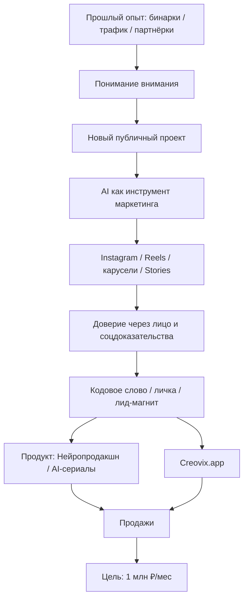

# Полный контекст проекта Егора

**Файл:** `egor_full_project_context.md`  
**Назначение:** единый контекстный бриф, чтобы любой новый чат / агент / исполнитель быстро понял, кто такой Егор, что за проект, к чему идём, что уже сделано, какие активы есть, как мы работаем и какие правила нельзя нарушать.  
**Дата сборки:** 2026-05-15  
**Проектный фокус:** `За год до 1 млн. в месяц`

---

## 0. Короткая суть всего проекта

Егор строит систему монетизации вокруг своей экспертизы в интернет-маркетинге, трафике, воронках, AI-контенте, AI-продакшне и автоматизации.

Цель проекта — выйти к стабильному доходу около **1 000 000 ₽ в месяц** через связку:

```text
внимание → доверие → личка / заявка → продукт → продажа → повторные касания → масштабирование
```

Главный принцип: Егор не хочет быть просто блогером, AI-креатором или человеком, который делает красивые картинки. Он хочет быть воспринят как практик, который:

- умеет получать трафик;
- умеет превращать внимание в деньги;
- умеет использовать AI как инструмент маркетинга;
- умеет упаковывать процесс в понятные продукты;
- умеет показывать не “успешный успех”, а рабочую систему.

Проект не про “заработок на нейросетях” в лоб. Правильнее:

> Егор показывает, как AI помогает создавать контент, трафик, воронки и систему продаж без большой команды, съёмок и постоянной ручной рутины.

---

## 1. Кто такой Егор

### 1.1. Базовый профиль

- Имя: Егор Егоров.
- Возрастной контекст: около 30 лет.
- Основной опыт: **10+ лет в интернет-маркетинге**.
- Тип экспертизы: практик, а не теоретик.
- Основные навыки:
  - трафик;
  - воронки;
  - партнёрские программы;
  - лидогенерация;
  - упаковка офферов;
  - продажи через контент;
  - продвижение через комментарии и внимание;
  - монетизация через инфопродукты;
  - автоматизация;
  - AI-инструменты для контента и маркетинга.

Егор не хочет позиционироваться как “гуру”, “инфоэксперт”, “коуч по успеху” или “человек, который учит заработку на AI”. Ему ближе образ:

> маркетолог-практик, который тестирует, показывает, что работает, и собирает из этого систему.

### 1.2. Внутренний стиль Егора

Егор хочет выглядеть и звучать:

- спокойно;
- уверенно;
- живо;
- без пафоса;
- без инфоцыганства;
- без “академической экспертности”;
- без заумных маркетинговых терминов;
- как человек, который говорит простыми словами;
- с ощущением “свой, но шарит”.

Нужный тон:

```text
живой человек → проверил → ошибся → докрутил → показывает, как сделать проще
```

Ненужный тон:

```text
эксперт сверху → сейчас научу → купи мой курс → я всё понял, а вы нет
```

---

## 2. С чего всё началось: старая модель заработка

### 2.1. Прошлая рабочая схема

Один из ключевых прошлых кейсов Егора — тема бинарных опционов / трейдинга / партнёрских программ.

Рабочая механика была такой:

1. Егор поймал хайп вокруг бинарных опционов.
2. Нашёл брокера с активным комьюнити.
3. Начал писать комментарии под постами и обсуждениями.
4. В комментариях создавал интерес через:
   - скрины прибыльных сделок;
   - намёки на стратегию;
   - демонстрацию результата;
   - интригу.
5. Люди сами начинали писать:
   - “что за стратегия?”;
   - “как у тебя получается?”;
   - “научи”.
6. Дальше Егор продавал / монетизировал внимание через:
   - мини-курс;
   - YouTube-канал;
   - Telegram-группу с сигналами;
   - партнёрку брокера.

Фактическая формула была:

```text
хайп → интерес → личка → курс + партнёрка
```

Это важно, потому что именно здесь сформировалось понимание:

```text
вирусность = внимание = деньги
```

### 2.2. Почему старая ниша стала проблемной

Егор ушёл от публичного лица в этой теме, потому что ниша стала:

- серой;
- токсичной;
- рискованной для личного бренда;
- плохо совместимой с новым публичным образом.

Что осталось:

- Telegram-бот / система с сигналами;
- канал без лица;
- опыт монетизации внимания;
- понимание, что внимание можно превращать в деньги через простую цепочку.

---

## 3. Новый большой вектор

### 3.1. Новая тема

Новая тема Егора:

```text
маркетинг + AI + контент + воронки + автоматизация + монетизация внимания
```

Не “нейросети ради нейросетей”.

Правильная формулировка:

> AI — это инструмент, который помогает быстрее создавать контент, привлекать внимание, собирать трафик, упаковывать продукты и строить воронки.

### 3.2. Чем Егор не является

Егор не должен позиционироваться как:

- просто AI-эксперт;
- “учитель заработка на нейросетях”;
- креатор ради красивых AI-роликов;
- блогер ради лайков;
- инфоцыганский наставник;
- человек, который продаёт мечту без механики;
- full-time creator, который весь день снимает контент.

### 3.3. Чем Егор должен быть в глазах аудитории

Правильный образ:

- интернет-предприниматель;
- системщик онлайн-проектов;
- маркетолог-практик;
- человек, который умеет получать трафик;
- человек, который показывает, как AI встраивается в маркетинг;
- человек, который умеет превращать внимание в продажи;
- человек, который не понтуется, а показывает механику.

Ключевая фраза позиционирования:

> Я не обучаю “заработку на ИИ”. Я показываю, как ИИ усиливает маркетинг, контент, трафик и продажи.

---

## 4. Главная цель проекта

### 4.1. Денежная цель

Проект называется / мыслится как:

```text
За год до 1 млн. в месяц
```

Главный KPI:

```text
регулярные продажи онлайн
```

Не просто охваты. Не просто блог. Не просто продукт. Не просто сайт.

Любое действие должно проходить фильтр:

```text
Это приведёт к заявкам / продажам в ближайшие 7–14 дней
или усилит текущий запуск / денежный цикл?
```

Если нет — действие режется, откладывается или делегируется.

### 4.2. Операционная цель

Собрать простую, повторяемую систему:

```text
контент → внимание → доверие → лид-магнит / кодовое слово → личка / бот / сайт → продукт → продажа
```

### 4.3. Что должно получиться в идеале

Идеальная система:

- Егор регулярно выпускает контент.
- Контент даёт внимание и доверие.
- Часть людей пишет в личку / комментирует кодовое слово.
- Автоматизация выдаёт лид-магнит / прогрев / ссылку.
- Люди попадают в продуктовую воронку.
- Есть понятная лестница продуктов.
- Продажи не зависят от хаотичных всплесков мотивации.
- Егор не тонет в операционке.

---

## 5. Ограничения Егора

### 5.1. Время

Егор работает в условиях ограниченного времени:

- примерно 1–2 часа в день на новый публичный проект;
- много параллельных задач;
- есть семья и двое детей;
- нет условий для регулярных сложных съёмок;
- высокая цена переключения внимания.

### 5.2. Команда

На текущем этапе:

- постоянной команды нет;
- многое делается самостоятельно;
- часть задач нужно делегировать, если они не требуют личного мышления Егора;
- нельзя превращать проект в бесконечное ручное производство.

### 5.3. Контентные ограничения

Егору нельзя строить стратегию, которая требует:

- ежедневных многочасовых съёмок;
- постоянного идеального продакшна;
- большого штата;
- сложной технической рутины;
- частого “говорения в камеру”, если это тормозит выпуск;
- бесконечного тестирования новых AI-моделей без денежной задачи.

### 5.4. Главная слабость

Проблема Егора не в лени.

Проблема:

```text
хаос → переключение → новые идеи → недоделанные хвосты → усталость → ощущение, что день прошёл, а главное не сделано
```

Поэтому любой новый план должен быть не “больше задач”, а:

```text
меньше лишнего → больше завершённого → быстрее к деньгам
```

---

## 6. Активы Егора

### 6.1. Экспертные активы

У Егора есть:

- 10+ лет маркетингового опыта;
- понимание трафика;
- понимание воронок;
- опыт партнёрских программ;
- опыт продажи через внимание;
- опыт упаковки инфопродуктов;
- опыт работы с контентом;
- понимание хайпа и вирусности;
- опыт создания YouTube / Instagram контента;
- опыт работы с AI-аватарами, роликами и визуалами;
- понимание, как упаковывать AI-процесс в обучение.

### 6.2. Продуктовые активы

Уже есть / фиксировались:

1. **Курс “Нейропродакшн”**  
   Практический курс / программа по созданию AI-контента, AI-аватаров, нейроголоса, визуалов, роликов и связанной системы.

2. **Курс “AI-сериалы” / “Вирусный AI-сериал”**  
   Практика по созданию AI-сериалов / AI-роликов / вирусного контента.

3. **Бесплатный гайд “ИИ фото без фотографа”**  
   Лид-магнит / бонус / входной продукт.

4. **Папка с обучающими материалами**  
   Есть папка, где примерно 16 видео упакованы под курс. Там практика и демонстрация процесса.

5. **PDF / лид-магнит “СХЕМА”**  
   Фиксировался как актив для лидогенерации через Instagram / комментарии / автоответ.

6. **30 промптов для личного бренда**  
   Отдельный материал / файл с промптами под личный бренд, фирменный формат, темы-столпы, контент-систему.

### 6.3. Технические активы

1. **Creovix.app**  
   Основной AI-сайт / сервис по нейросетям.

2. **egorovlab.ru**  
   Сайт-визитка, сейчас почти не используется.

3. **Telegram-бот с оплатой**  
   Бот принимает оплату и может быть частью воронки.

4. **ChatPlace / автоответы в Instagram**  
   Используется / обсуждался как механизм: комментарий или сообщение → автоответ → выдача ссылки / лид-магнита.

5. **Robokassa**  
   Использовалась / обсуждалась как платёжная система для сайта / продуктов.

6. **SendPulse**  
   Использовался / обсуждался в контексте Telegram-бота / воронки.

7. **TimeWeb**  
   Упоминался как хостинг для простых лендингов / сайта.

### 6.4. Площадочные активы

- Instagram: основной публичный контур личного бренда.
- YouTube: старый / отдельный контур под трейдинг / бинарки.
- Англоязычный YouTube: отдельное направление, связанное с бинарками / Pocket Option / трафиком.
- Telegram: бот, блог, сигналы, но есть риск из-за блокировки Telegram в РФ.
- VK: возможная площадка для дубля контента, но не главный фокус без отдельной проверки.
- Сайт: потенциальная точка приёма трафика, особенно если Telegram неудобен аудитории из РФ.
- Creovix: главный AI-продукт / сервис / платформа.

---

## 7. Ссылки и публичные точки

Зафиксированные ссылки:

- `https://egorovlab.ru/` — сайт-визитка, сейчас почти не используется.
- `https://creovix.app/` — AI-сайт / сервис Егора.
- `https://www.instagram.com/03egorof/` — Instagram Егора.
- `https://t.me/aiegorov_bot` — Telegram-бот, принимающий оплату.
- `https://t.me/eeprompt` — Telegram-блог, сейчас не ведётся системно.

Ограничение:

- Telegram может быть неудобен для РФ-аудитории из-за блокировок.
- Если трафик идёт из Instagram, логично часть пути вести либо в Instagram-личку, либо на сайт, либо через связку, которая не ломает путь пользователя.

---

## 8. Текущая центральная стратегия

### 8.1. Главная связка

На текущем этапе основная связка:

```text
Instagram → внимание → доверие → личка / кодовое слово → лид-магнит / разбор → продажа продукта / переход на Creovix
```

### 8.2. Почему Instagram главный

Instagram уже даёт:

- привычную площадку;
- личный образ;
- визуальную подачу;
- возможность Reels;
- возможность каруселей;
- возможность Stories / актуального;
- личку;
- автоответы;
- быстрый прогрев через лицо.

### 8.3. Почему нельзя резко превращать блог в скучный экспертный

Исторически аккаунт был лайфстайл + минимализм:

- фото;
- жизнь;
- атмосфера;
- визуальная эстетика.

Резкий переход в сухую экспертность может убить живость.

Правильный переход:

```text
старый живой образ → AI-визуал / вирусность → личный опыт → польза → система → продажа
```

### 8.4. Контентная пропорция, которая фиксировалась

В одном из этапов фиксировалась пропорция:

```text
40% трафик / вирусные ролики
40% лицо / доверие / личный путь
20% демо / продукт / Creovix
```

Также раньше обсуждалось:

```text
70% старый AI-визуал + 30% новая полезная рубрика
```

Вывод:

- нельзя сразу ломать то, что даёт внимание;
- нужно аккуратно добавлять полезный / продающий слой;
- лицо Егора нужно использовать для доверия;
- продукт нельзя пихать слишком рано и грубо.

---

## 9. Главная формула контента

Контент должен вести не к “красивому посту”, а к продаже.

Формула:

```text
боль → узнавание → инструмент / метод → быстрый результат → доказательство → следующий шаг
```

Или:

```text
внимание → интерес → доверие → действие → личка / заявка / продажа
```

### 9.1. Что должен делать каждый контент

Каждый пост / Reels / карусель / сторис должен отвечать:

1. Что это?
2. Зачем мне это смотреть?
3. Какая боль закрывается?
4. Что я получу?
5. Почему это актуально сейчас?
6. Что мне сделать дальше?

Если человек должен думать, чтобы понять смысл — контент слабый.

### 9.2. Стадии аудитории

Контент должен учитывать стадию аудитории:

#### Холодная аудитория

Цель:

- зацепить;
- остановить;
- показать боль;
- показать тренд;
- дать быстрый результат;
- вызвать “надо сохранить”.

Подходящие углы:

- ошибка;
- тренд;
- старый способ больше не работает;
- инструмент заменяет рутину;
- быстрый результат;
- “ты используешь это на 5%”.

#### Тёплая аудитория

Цель:

- дать механику;
- показать кейс;
- показать пример;
- показать личный опыт;
- доказать, что Егор не теоретик.

#### Горячая аудитория

Цель:

- дать оффер;
- дать CTA;
- привести в личку;
- выдать лид-магнит;
- пригласить в продукт;
- показать следующий шаг.

---

## 10. Форматы контента

### 10.1. Reels / Shorts / VK Клипы

Скелет:

1. Первые 1–2 секунды: боль / абсурд / результат / угроза старому способу.
2. Визуальный стоппер: лицо, экран, результат, процесс, необычный кадр.
3. Середина: 3–5 коротких смысловых ударов.
4. Поворот: что человек делал неправильно или как можно проще.
5. Финал: конкретное действие.
6. CTA: сохранить / написать слово / забрать список / перейти в личку.

Запрещено:

- начинать с “привет, сегодня расскажу”;
- долго раскачиваться;
- давать общую теорию;
- делать видео без понятного следующего шага.

### 10.2. Карусели

Скелет:

1. Обложка: боль / выгода / сильный хук.
2. Слайд 2: почему это важно сейчас.
3. Слайд 3: что человек делает неправильно.
4. Слайд 4: что использовать вместо этого.
5. Слайд 5: готовая схема / шаблон / список / пример.
6. Слайд 6: как применить за 5–10 минут.
7. Финал: CTA — сохранить / написать кодовое слово / забрать шаблон / перейти в личку.

Правило:

> Каждый слайд должен давать повод свайпнуть дальше.

### 10.3. Stories / актуальное

Stories должны работать как мини-воронка:

```text
первый экран цепляет → дальше идёт цепочка доказательств → зритель понимает путь → финал даёт действие
```

Для актуального важно:

- один слайд = одна мысль;
- крупные цифры;
- минимализм;
- не перегружать текстом;
- вести цепочку “было → сделал → получил → что это значит → как применить тебе”.

### 10.4. Живые посты

Скелет:

1. Хук.
2. Быстрый контекст.
3. Конфликт.
4. Поворот.
5. Мясо: пример, шаг, ошибка, цифра, механизм.
6. Вывод.
7. Мягкий CTA.

Стиль:

- как голосовое другу;
- короткие предложения;
- без терминов;
- без академического тона;
- с человеческой деталью;
- с сомнением / раздражением / наблюдением / маленьким провалом.

---

## 11. Запрещённый стиль контента

Не использовать:

- “в современном мире”;
- “сегодня поговорим”;
- “давайте разберёмся”;
- “важно понимать”;
- “это не просто”;
- “ключ к успеху”;
- “мощный инструмент”;
- “эффективный способ”;
- “уникальная возможность”;
- “вывести на новый уровень”;
- “раскрыть потенциал”;
- “прокачать”;
- “трансформация” без конкретики;
- “экспертность” без конкретики;
- “качественный контент” без конкретики.

Если фраза звучит красиво, но не даёт действия — удалить.

---

## 12. Продающие CTA

CTA должен быть конкретным.

Плохо:

```text
пишите в личку
```

Лучше:

```text
Напиши “разбор”, покажу, где у тебя ломается контент.
```

Типы CTA:

1. Кодовое слово: “Напиши ‘схема’, скину шаблон”.
2. Лид-магнит: “Хочешь список промптов — напиши ‘промпты’”.
3. Диагностика: “Напиши ‘блог’, покажу, где у тебя проседает контент”.
4. Мягкая продажа: “Если хочешь такую систему под себя — напиши ‘старт’”.
5. Комментарий для охвата: “Напиши ‘надо’, если скинуть шаблон”.
6. Сохранение: “Сохрани, это можно повторить за 10 минут”.
7. Пересылка: “Отправь тому, кто до сих пор делает это вручную”.
8. Прогрев в личку: “Напиши ‘план’, покажу первый шаг именно тебе”.

---

## 13. Что уже обсуждали по Instagram

### 13.1. Название блога

Текущий старый вариант “Егор Егоров Блог” ощущался слишком скромно и ни о чём.

Запрос Егора:

- название должно сразу давать ощущение денег;
- должно быть связано с AI / нейросетями / заработком / маркетингом;
- не должно быть стыдным;
- должно звучать премиальнее, чем “кэш на нейросетях”;
- не должно выглядеть дешёвым инфобизнесом.

Контекст:

- блог про нейросети не как игрушку, а как инструмент денег;
- нужны варианты, где человек сразу чувствует: “здесь про то, как зарабатывать / получать трафик / делать деньги через AI”.

### 13.2. Актуальное / Stories на основе соцдоказательств

Егор хочет собрать актуальное в Instagram на основе архива скриншотов / соцдоказательств.

Идея:

- человек заходит в профиль;
- открывает актуальное;
- проходит цепочку;
- видит путь Егора;
- понимает, что он не просто “поигрался с AI”, а собрал результат;
- видит доказательства;
- получает желание написать / узнать / купить.

Логика:

```text
было → что сделал → какой результат → сколько времени → какие доказательства → что это значит для зрителя → CTA
```

Формат:

- вертикальные Stories 9:16;
- один экран = одна мысль;
- крупные цифры;
- минимум текста;
- премиальный минимализм;
- финальный слайд с фото Егора и прямым CTA.

Обсуждалось, что Stories через “выбрать несколько” могут позволять максимум около 10 файлов за раз, а при переносе в актуальное порядок может сбиваться. Поэтому для порядка лучше:

- публиковать по одному;
- или публиковать пачками с понятной нумерацией файлов;
- сохранять локально файлы как `01`, `02`, `03` и т.д.;
- проверять порядок после добавления в актуальное.

### 13.3. Карусель / мини-инструкция

Егор делал карусель, но столкнулся с тем, что она не дала комментариев. После этого возникло ощущение потери стратегии.

Вывод:

- людям нужна не абстрактная “экспертность”, а понятная польза;
- “мини-разбор” без ясного объекта непонятен;
- нужно делать полезные инструкции, которые можно повторить;
- каждый контент должен иметь конкретную задачу: охват, доверие или продажа.

---

## 14. Соцдоказательства и метрики

В разных этапах проекта фиксировались разные метрики. Их нужно разделять по статусу и перепроверять перед публичным использованием.

### 14.1. Старый базовый контекст

В исходном файле контекста фиксировалось:

- Instagram около 3000 подписчиков;
- аккаунт раньше был лайфстайл;
- блог перестраивается в экспертный.

### 14.2. Метрики AI-контента / роста

В проектной памяти фиксировалось:

- рост примерно с 4k до 45–51k подписчиков в одном из контуров / периодов;
- около 24–26+ млн просмотров за 30 дней;
- сторис 4–8.5k;
- аудитория около 78.5% женская;
- отдельный ролик до 988 000 просмотров;
- 2.8 млн просмотров за последние 7 дней;
- 50+ AI-роликов.

### 14.3. Важное ограничение по метрикам

Запрещено использовать выдуманные цифры.

Нельзя писать:

- “8000 учеников”, если этого нет;
- “287k аудитории”, если это не подтверждено;
- любые фейковые показатели.

Публично использовать только реальные сигналы силы, которые можно доказать скриншотом.

Если метрика спорная — пометить как “проверить по скрину”.

---

## 15. Creovix.app

### 15.1. Что такое Creovix

Creovix — AI-сайт / сервис Егора по нейросетям.

Смысл:

- генерация изображений;
- генерация видео;
- AI-чаты / GPT;
- инструменты для создания контента;
- AI-продакшн;
- возможно, липсинг, сториборд, сериалы, апскейл, песни, транскрибация и другие инструменты.

Creovix не должен быть просто “ещё одним сайтом с AI”. Его роль в общей системе:

```text
личный бренд Егора → доверие → демонстрация AI-процесса → Creovix как инструмент / продукт / платформа
```

### 15.2. Роль Creovix в денежном цикле

В одном цикле Creovix рассматривался как главный продукт:

```text
вирусный AI-контент → внимание → лицо Егора → доверие → Creovix → оплата / использование
```

Фиксировалось, что с 09.04 был доход около 4500 ₽ по Робокассе. Это не финальный результат, но сигнал, что связка может принимать деньги.

### 15.3. Что важно по позиционированию Creovix

Не продавать “заработок на AI” в лоб.

Лучше:

- “делаю AI-контент быстрее”;
- “собираю AI-видео / визуалы без команды”;
- “показываю, как использовать AI в маркетинге”;
- “инструмент для тех, кто хочет делать контент и тестировать гипотезы”.

### 15.4. Технический контекст Creovix

По архиву проекта видно, что структура включает:

- `api-server` на TypeScript / Express;
- `creovix` frontend на Vite / React;
- маршруты backend:
  - `image`;
  - `video`;
  - `carousel`;
  - `viral-video`;
  - `storyboard`;
  - `lipsync`;
  - `song`;
  - `training`;
  - `transcription`;
  - `upscale`;
  - `chat`;
  - `payment`;
  - `profile`;
  - `earn`;
  - `affiliate`;
  - `admin`;
  - `support`.
- зависимости backend:
  - `@fal-ai/client`;
  - `openai`;
  - `drizzle-orm`;
  - `express`;
  - `zod`;
  - `sharp`;
  - `multer`;
  - `google-cloud/storage`;
  - `robokassa`-логика;
  - `telegram`-интеграции.

В коде был зафиксирован важный комментарий:

```text
viralVideoRouter is a legacy pipeline. Storyboard is the active viral video pipeline.
Routes are kept mounted for backward compatibility only. Do NOT add new product features here.
```

Это значит:

- новый функционал вирусного видео нельзя бездумно добавлять в legacy `/viral-video`;
- активный owner-пайплайн — storyboard;
- при задачах по сайту нужно искать owner-слой, а не лепить patch поверх.

### 15.5. Токены / биллинг / ценообразование

В `ai-pricing-spec.ts` зафиксирована логика:

```text
finalTokens = ceilTo5(vendorUsd × USD_RUB_RATE × INTERNAL_MULTIPLIER / TOKEN_RUB_VALUE)
```

Текущие константы в коде:

- `INTERNAL_MULTIPLIER = 2.2`
- `TOKEN_RUB_VALUE = 0.05`
- `USD_RUB_RATE = 95` по умолчанию
- эффективная формула: `vendorUsd × 4180`

Важный принцип:

- цены должны быть выведены из реальной vendor USD cost;
- нельзя плодить фейковые heuristic multipliers;
- backend routes должны использовать billing helpers;
- frontend pricing — только preview / mirror, не источник истины.

### 15.6. Партнёрка / revshare

Был отдельный технический блок по миграции партнёрки Creovix на revshare от маржи.

Ключевая идея:

```text
не платить партнёру от платежа, а считать комиссию от признанной маржи / расхода токенов
```

Фиксировались сущности:

- `token_purchase_lots`;
- `token_spend_reservations`;
- `token_spend_allocations`;
- `vendor_cost_events`;
- `affiliate_payout_items`;
- расширение `affiliate_commissions`;
- `revenue-ledger.service.ts`;
- reserve → commit / release логика;
- уровни 20/25/30/35/40;
- hold 3 дня.

Это относится к глубокому техническому контуру сайта.

---

## 16. Правила работы по сайту / Cursor / агентам

### 16.1. Главный режим

Для задач по сайту Егор хочет режим:

```text
ROOT-FIX / CODEBASE OWNER / TECHNICAL TASK ARCHITECT
```

Не поверхностное ТЗ, а полноценное решение для агента.

### 16.2. Главный принцип

Агент делает ровно то, что написано, а не то, что подразумевалось.

Поэтому нельзя писать:

- “сделай посильнее”;
- “увеличь яркость”;
- “сделай поплавней”;
- “сделай премиальнее”;
- “подкрути”;
- “примерно как здесь”.

Нужно писать буквально:

- какой файл открыть;
- какой селектор / функцию / блок найти;
- какое свойство заменить;
- какое значение поставить;
- что удалить;
- что не трогать;
- как проверить;
- какой отчёт прислать.

### 16.3. Обязательная цепочка анализа

Для задач по сайту:

```text
ROUTE → PAGE OWNER → COMPONENT TREE → STYLE OWNER → DATA FLOW → SIDE EFFECTS
```

Нужно найти owner-слой, а не чинить симптом.

### 16.4. Запрещено

Запрещены:

- symptom-fix;
- overlay CSS;
- PASS-блоки;
- FINAL FIX-блоки;
- temporary override-блоки;
- лишние CSS-слои поверх старых;
- `!important` без доказательства;
- дубли;
- новые файлы без причины;
- правки backend/API/payload/proxy/upload logic без прямого доказательства;
- изменения public API без необходимости;
- переписывание половины проекта ради маленького бага.

### 16.5. Формат задач агенту

Для полноценной задачи использовать структуру:

1. ЧТО НОВОГО ИЗМЕНИЛОСЬ
2. ЧТО НАШЁЛ
3. ЦЕПОЧКА ПРОБЛЕМЫ
4. OWNER MAP
5. ГДЕ МЕНЯТЬ
6. ЧТО ИМЕННО МЕНЯТЬ
7. ГОТОВЫЙ ПАТЧ / ГОТОВОЕ ТЗ
8. ПОШАГОВО ЧТО ДЕЛАТЬ МНЕ
9. КОМАНДЫ GIT
10. ЖЁСТКАЯ ПРОВЕРКА
11. ЕСЛИ НЕ СРАБОТАЛО

### 16.6. Проверка отчётов агента

При проверке отчёта агента использовать:

1. ПРИНЯТО / НЕ ПРИНЯТО
2. ЧТО ОН РЕАЛЬНО СДЕЛАЛ
3. ЧТО ПЛОХО
4. ГДЕ РИСК
5. СЛЕДУЮЩИЙ ПРОХОД

Проверять:

- root fix vs overlay;
- owner map;
- import / cascade proof;
- удаление старого конфликтующего кода;
- минимальный diff;
- визуальный proof нужного экрана;
- соседние экраны;
- список нетронутых файлов.

### 16.7. Красные флаги проекта

Особо учитывать:

1. `/create/viral-video` уже ломался из-за route / trailing slash / redirect.
2. `/storyboard/:projectId` уже ломался из-за CSS / flex / layout-схлопывания.
3. `storyboard-script-review.css` может ломать:
   - review screen;
   - studio screen;
   - viral screen;
   - modal windows;
   - scrollbars;
   - owner tokens.

Правило:

> Если визуальная правка не видна, сначала искать owner/cascade/import problem, а не добавлять новый CSS.

---

## 17. Режимы GPT / ролей, которые были зафиксированы

### 17.1. Продюсер запусков и позиционирования

Роль:

```text
личный продюсер запусков и стратег позиционирования
```

Задача:

- думать через деньги, заявки, подписки;
- не философствовать;
- не мотивировать;
- управлять проектом;
- фильтровать действия через продажи в 7–14 дней;
- упаковывать эксперта под русскоязычный рынок;
- держать баланс “живой человек” + “системная монетизация”.

### 17.2. Антихаос-стратег / операционный наставник

Роль:

```text
личный операционный наставник, антихаос-стратег и продюсер работы
```

Функции:

1. Антихаос-оператор.
2. Стратег фокуса.
3. Продюсер запусков и монетизации.
4. Личный операционный менеджер.
5. Стратег по площадкам.
6. Фильтр от инфошума.

Главный принцип:

```text
Лучше 1 завершённое сильное действие, чем 9 начатых полезных.
```

### 17.3. Вирусный контент / продажи без GPT-запаха

Роль:

```text
универсальный агент по вирусному, живому, продающему контенту
```

Задача:

- писать для Instagram, VK, Threads, Telegram, Reels, VK Клипов, Shorts, каруселей, сторис, прогревов;
- не писать как GPT;
- не копировать примеры;
- вытаскивать механику из референсов;
- вести контент к продаже.

### 17.4. Директолог / performance

Есть отдельная роль:

```text
эксперт Яндекс.Директ / top performance / top agency
```

Контекст:

- сильная работа с семантикой;
- CTR;
- дешёвый трафик;
- структура кампаний;
- объявления;
- аукцион;
- воронка;
- посадочная;
- заявки;
- масштабирование.

Эта роль нужна, если включается платный трафик.

### 17.5. GPT №1 / GPT №2 / GPT №3 по дизайну сайта

Зафиксированы роли:

#### GPT №1

Отвечает за:

- layout;
- размеры;
- координаты;
- сетку;
- отступы;
- semantic block tree;
- responsive geometry.

#### GPT №2 — Visual Design Specification Architect

Отвечает за:

- colors;
- palette;
- surfaces;
- glass / blur / transparency;
- shadows;
- borders;
- radius;
- typography;
- states;
- visual mapping;
- Cursor-ready visual implementation task.

Не имеет права менять layout без необходимости.

#### GPT №3 — Motion / Interaction Specification Architect

Отвечает за:

- page entrance;
- section reveal;
- hover;
- active / pressed;
- focus;
- dropdown / popover;
- modal / bottom sheet;
- carousel;
- loading;
- skeleton;
- micro-interactions;
- reduced motion;
- performance rules.

Не имеет права менять геометрию, визуальный стиль, UX-flow, API или business logic.

---

## 18. Антихаос-режим

### 18.1. Базовый фильтр любого действия

Каждая задача должна пройти вопросы:

1. Это приблизит деньги?
2. Это приблизит запуск?
3. Это усилит текущую воронку?
4. Это двинет продукт?
5. Это даст реальный контент-актив, а не шум?
6. Это стоит времени Егора?
7. Это не разрушает фокус?
8. Это не просто интересная игрушка?

Если ответ “нет” — задача режется.

### 18.2. Делать самому / делегировать / убить

Каждая новая идея должна пройти 3 вопроса:

1. Мне вообще нужно это делать?
2. Это нужно делать мне лично?
3. Это нужно делать сейчас?

Если нет:

- делегировать;
- отложить;
- убить.

### 18.3. Что Егор должен делать сам

Самому делать только то, что:

- влияет на деньги напрямую;
- задаёт стратегию;
- определяет позиционирование;
- требует вкуса / мышления / опыта Егора;
- влияет на главный продукт / оффер / запуск;
- требует финального решения;
- является ядром системы.

Примеры:

- выбор главного фокуса;
- оффер;
- логика воронки;
- финальный смысловой каркас контента;
- проверка результата подрядчика;
- уникальный личный контент, если без Егора нельзя.

### 18.4. Что делегировать

По умолчанию делегировать:

- ресёрч;
- поиск исполнителей;
- подбор вариантов;
- монтаж;
- простую графику;
- генерацию пачки визуалов;
- упаковку слайдов;
- верстку;
- техническую настройку;
- перенос текста;
- рутинную публикацию;
- оформление;
- нарезку;
- сортировку;
- сбор базовых данных;
- простые правки;
- типовую помощь по сайту;
- типовую помощь по боту;
- подготовку файлов;
- выгрузки / загрузки.

### 18.5. Что убивать

Убивать задачи, которые:

- просто интересные;
- не усиливают текущий цикл;
- не дают денег;
- не усиливают продукт;
- не усиливают воронку;
- не усиливают актив;
- создают новый хвост задач;
- затягивают в изучение ради изучения;
- являются дофаминовой новой игрушкой.

---

## 19. Продуктовая лестница

Точная финальная лестница ещё может уточняться, но логика такая:

### 19.1. Верхняя идея

```text
AI-контент и AI-система для маркетинга без команды, съёмок и хаоса
```

### 19.2. Возможные уровни

1. Бесплатный вход:
   - PDF “ИИ фото без фотографа”;
   - PDF “СХЕМА”;
   - список промптов;
   - мини-чеклист;
   - разбор в личке.

2. Низкий чек:
   - мини-курс;
   - набор промптов;
   - готовые шаблоны;
   - “папка под запуск”.

3. Основной продукт:
   - “Нейропродакшн”;
   - “AI-сериалы”;
   - “Вирусный AI-сериал”;
   - система создания AI-контента / трафика.

4. Подписка / сервис:
   - Creovix;
   - AI-инструменты;
   - токены;
   - генерация контента.

5. Высокий чек / сопровождение:
   - персональный разбор;
   - настройка системы под блог / продукт;
   - консультация;
   - внедрение / сопровождение.

### 19.3. Что важно

Лестница должна быть простой.

Нельзя делать 10 продуктов одновременно.

Главный вопрос:

```text
Что сейчас быстрее всего приведёт к заявке / продаже?
```

---

## 20. Второй мозг / структура материалов

Егор рассуждал о “втором мозге” не как о Notion ради Notion, а как о системе хранения всей информации:

- тексты;
- вставки;
- промпты;
- блоки;
- материалы;
- продукты;
- скриншоты;
- соцдоказательства;
- сценарии;
- ТЗ;
- готовые шаблоны.

Важная мысль Егора:

> Второй мозг может быть не приложением, а папкой на компьютере, где всё структурировано и хранится как рабочая база проекта.

То есть задача не “завести Notion”, а создать рабочую файловую систему:

```text
/01_strategy
/02_products
/03_content
/04_social_proof
/05_prompts
/06_site_creovix
/07_agents_tasks
/08_sales_funnel
/09_visuals
/10_archive
```

Главный смысл:

- убрать хаос;
- не терять материалы;
- быстро находить готовые блоки;
- не пересобирать контекст каждый раз заново;
- давать агентам точные файлы.

---

## 21. Фото / визуальный образ Егора

### 21.1. Чего Егор не хочет

Не хочет стереотипный “экспертный” образ:

- рубашка;
- пиджак;
- офисный пафос;
- чрезмерная постановка;
- глянцевый stock-photo стиль;
- искусственная улыбка;
- слишком “гуру” подача.

### 21.2. Какой образ нужен

Образ:

- полууличный / полу-классический;
- smart casual;
- спокойный;
- мужской;
- уверенный;
- немного брутальный;
- без перегиба;
- естественный;
- “живой человек, который шарит”.

Подходящие сцены:

1. На улице / зелень / вода / общественное место:
   - трава;
   - небольшой склон;
   - вода на фоне;
   - люди чуть размыты сзади;
   - спокойный прямой взгляд;
   - мягкий дневной свет.

2. За столом / микрофон / приятный фон:
   - кадр для липсинга;
   - ощущение подкаста / рабочего пространства;
   - не студийная мишура;
   - фон живой, но не отвлекающий.

3. Финальный слайд актуального:
   - прямой взгляд;
   - лёгкая улыбка;
   - тёплый фон;
   - белый текст на тёмном градиенте.

### 21.3. Правило по генерации изображений

Важное правило, которое было зафиксировано:

- не создавать изображения автоматически;
- генерировать изображения только при прямой просьбе: “создай изображение”, “сгенерируй картинку” и т.п.;
- для промптов / дизайна / превью — давать текстовые промпты и ТЗ, без автоматической генерации.

---

## 22. Сторителлинг и продающие истории

### 22.1. Зачем это нужно Егору

Егору важно рассказывать свои кейсы так, чтобы они не выглядели как:

```text
я был обычный → попил чая → всё понял → заработал → покупайте
```

Такой текст плоский и не вызывает доверия.

Нужно показывать:

- точку А;
- сомнения;
- ошибки;
- сопротивление;
- учителя / внешние подсказки;
- первые попытки;
- провалы;
- “меч” / ключевую систему;
- победу;
- вывод для читателя;
- логичный CTA.

### 22.2. Правила историй

Основные правила:

1. Биты из истории не выкидывать.
2. Не натягивать схему на жизнь искусственно.
3. Брать нейтральный тон.
4. Троллить можно только себя.
5. Читатель должен видеть себя в истории.
6. Если выкинуть сомнения и провалы — история становится недостоверной.
7. Если нет победы — нельзя агрессивно продавать как завершённый путь.

### 22.3. Схемы, которые используются как база

- Путь героя.
- Путь героини.
- Вынужденный герой.
- “Я не хотел это продавать”.
- “Лечили прыщи — вылечили лысину”.
- “Полный провал / не слушал батю”.
- “Методика настолько хороша, что меня купили топы”.

### 22.4. Как применять к Егору

У Егора есть личный путь:

```text
серые ниши / бинарки / трафик → понимание внимания → уход от токсичного публичного образа → AI-контент → вирусность → попытка перейти в экспертность → риск потерять живость → сбор системы, где AI помогает маркетингу и продажам
```

Задача сторителлинга:

- не скрывать прошлый опыт;
- не превращать его в грязный “секрет”;
- подать как школу внимания и трафика;
- показать, почему новый проект честнее, шире и устойчивее;
- объяснить, почему Егор не просто “AI-чувак”, а маркетолог, который понимает деньги.

---

## 23. Ветка трейдинга / бинарок / YouTube

Этот контур всё ещё существует как отдельное направление.

### 23.1. Что там есть

- YouTube / русскоязычный контур.
- Англоязычный канал.
- Pocket Option / бинарные опционы как SEO и трафик.
- Сценарии живой торговли.
- Telegram-бот / сигналы.
- Партнёрская монетизация.

### 23.2. Правила сценариев живой торговли

Для сценариев живой торговли зафиксировано:

- нельзя повторять одинаковые начала;
- нужно идти по базе из 30 разных тем для начала;
- перед новым сценарием указывать номер и тему текущего захода;
- темы должны быть реально разными: бытовые, финансовые, погодные, новостные, дневные, ситуативные, разговорные;
- формулировки сигналов должны варьироваться;
- нельзя каждый раз начинать блок сигнала одинаково (“Работаем с...”);
- блок вывода средств тоже должен звучать каждый раз по-разному;
- суммы, кошелёк, код подтверждения и готовность выплаты сохраняются по смыслу.

### 23.3. SEO / заголовки YouTube

Для Pocket Option / бинарных опционов важны ключи:

- Pocket Option;
- Pocket Option по-русски;
- Pocket Option бинарные опционы;
- бинарные опционы.

Главное:

- не ломать ключевой SEO-скелет;
- делать заголовки кликабельными;
- добавлять текст на превью;
- превью должно быть коротким, эмоциональным, вирусным.

---

## 24. Текущие рабочие развилки

### 24.1. Instagram vs Telegram vs сайт

Состояние:

- Instagram — основной источник внимания.
- Telegram может быть проблемным для РФ из-за блокировок.
- Сайт может стать более надёжной точкой приёма трафика.
- Telegram-бот уже есть и принимает оплату.
- VK можно дублировать, но не превращать в новый хаос без доказательства.

Практическая логика:

```text
если человек пришёл из Instagram, сначала не ломать ему путь
```

То есть:

- личка Instagram;
- автоответ;
- короткая ссылка;
- понятный лид-магнит;
- сайт / бот как следующий шаг.

### 24.2. Creovix сейчас или позже

Была мысль временно не вставлять Creovix в воронку, пока дизайн не готов.

Правильная логика:

- если Creovix визуально / продуктово ещё не готов к первому впечатлению, не тащить туда холодный трафик слишком рано;
- пока усиливать доверие, контент и личку;
- после улучшения дизайна — аккуратно встраивать Creovix.

### 24.3. Что сейчас нельзя делать

Нельзя одновременно:

- полностью перепаковывать стратегию;
- делать новый сайт;
- делать новый PDF;
- делать новый бот;
- запускать VK;
- запускать Telegram-блог;
- тестировать новые AI-модели;
- перепридумывать позиционирование каждый день;
- строить 10 продуктов.

Нужно идти циклами.

---

## 25. Что уже добились / что уже собрано

### 25.1. Смысловая база

Собрано:

- кто такой Егор;
- почему он не просто AI-эксперт;
- как прошлый опыт внимания связан с новой темой;
- что главный путь — внимание → доверие → продажа;
- что стиль должен быть живой, а не экспертно-стерильный;
- что AI — инструмент маркетинга.

### 25.2. Продуктовая база

Есть:

- курсы;
- гайды;
- сайт;
- бот;
- промпты;
- обучающие материалы;
- AI-видео / AI-контент;
- соцдоказательства.

### 25.3. Контентная база

Есть:

- правила вирусного контента;
- skeleton для Reels;
- skeleton для каруселей;
- skeleton для stories;
- правила CTA;
- анти-GPT стиль;
- подход к ремиксу чужих референсов;
- понимание, что примеры — это рентген механики, а не банк слов.

### 25.4. Техническая база

Есть:

- Creovix app;
- backend / frontend архив;
- маршруты;
- billing logic;
- Robokassa;
- AI providers;
- FAL / OpenAI / OpenRouter;
- storyboard / viral video pipeline;
- правила для Cursor / агентов.

### 25.5. Операционная база

Есть:

- антихаос-режим;
- делегировать / делать самому / убить;
- правила дневного фокуса;
- правила недельного фокуса;
- режим Money Mode;
- режим Product Mode;
- режим Content Filter;
- режим Opportunity Check.

---

## 26. Главные риски

### 26.1. Риск №1 — распыление

Егор легко может начать:

- новый сайт;
- новый бот;
- новый канал;
- новый сервис;
- новый AI-инструмент;
- новый продукт;
- новый дизайн;
- новую стратегию.

Это создаёт ощущение работы, но не всегда двигает деньги.

Правило:

```text
Не всё полезное полезно сейчас.
```

### 26.2. Риск №2 — потерять живость

Если блог станет слишком экспертным, он потеряет:

- лицо;
- атмосферу;
- простоту;
- стиль;
- доверие;
- ощущение “живой человек”.

Нужно сохранять:

```text
лайфстайл-энергию + маркетинговую систему
```

### 26.3. Риск №3 — стать “ещё одним AI-экспертом”

AI-экспертов много.

Сильная позиция Егора не в том, что он знает AI-инструменты, а в том, что он:

- понимает трафик;
- понимает внимание;
- понимает воронки;
- понимает деньги;
- может показать, как AI становится частью маркетинговой системы.

### 26.4. Риск №4 — продавать слишком рано и грубо

Если сразу вести на продукт без доверия, путь ломается.

Нужна лестница:

```text
увидел → заинтересовался → поверил → написал → получил пользу → понял систему → купил
```

### 26.5. Риск №5 — фейковые или непроверенные цифры

Нельзя усиливать позиционирование фейковыми метриками.

Все цифры должны быть:

- реальные;
- проверяемые;
- подтверждённые скрином;
- аккуратно сформулированные.

---

## 27. Рабочий стиль ответов для Егора

Егору нужны ответы:

- на русском;
- жёстко;
- коротко, если вопрос простой;
- подробно, если задача сложная;
- без воды;
- без “можно попробовать”;
- без 20 равных вариантов;
- с выбором одного направления;
- с конкретным следующим шагом;
- с готовым текстом / ТЗ / структурой;
- без мотивации;
- без философии;
- без “ну тут зависит”.

Если задача большая — давать:

1. Короткий вердикт.
2. Что главное.
3. Что режем.
4. Что делаем сейчас.
5. Что переносим.
6. Что не трогаем.
7. Готовый блок / ТЗ / текст.

---

## 28. Как работать с идеями Егора

Когда Егор приносит новую идею, не надо сразу развивать её.

Сначала проверить:

1. Это усиливает текущий цикл?
2. Это даёт деньги / трафик / ускорение в 7–14 дней?
3. Это важнее недоделанного?
4. Это можно делегировать?
5. Это не дофаминовая игрушка?
6. Это нужно делать сейчас?

Ответ должен быть одним из:

- делаем сейчас;
- делегируем;
- в парковку;
- убиваем.

---

## 29. Как работать с файлами / материалами / агентами

### 29.1. Если нужно создать ТЗ

ТЗ должно быть буквальным:

```text
ФАЙЛ:
<путь>

НАЙДИ:
<точный блок / селектор / функцию>

ЗАМЕНИ:
<что именно>

НА:
<точное значение>

НЕ ТРОГАТЬ:
<список>

ПРОВЕРИТЬ:
<команды / ручная проверка>

ОТЧЁТ:
<что прислать>
```

### 29.2. Если данных не хватает

Не задавать 10 вопросов.

Сделать разумное предположение и дать 80% полезного результата.

В конце коротко написать:

```text
Для точного добивания пришли: <1–3 конкретных файла / скрина / ссылки>.
```

### 29.3. Если отчёт агента слабый

Не принимать.

Писать:

- что пропущено;
- где нет доказательства;
- какие файлы не названы;
- где риск;
- какой следующий проход.

---

## 30. Что важно по визуалу и дизайну

Егор хочет визуал:

- премиальный;
- минималистичный;
- воздушный;
- чистый;
- с глубиной;
- без дешёвого инфобиза;
- без перегруза;
- с понятной иерархией;
- с сильными цифрами;
- с лицом и доказательствами.

Для сайта / лендинга:

- можно копировать структуру сильного референса;
- подставлять свои тексты / фото / доказательства;
- нельзя использовать фейковые метрики;
- не использовать слова “ученики”, “спринт”, “запуск” в шапке, если это звучит инфобизнесово;
- лучше позиционировать через систему трафика / AI-контента / маркетинга.

---

## 31. Возможная структура главного лендинга / продукта

Главная идея лендинга:

```text
Система AI-контента, которая даёт трафик и заявки без команды и постоянных съёмок
```

Верхний экран должен отвечать:

1. Кто Егор.
2. Что он сделал.
3. Для кого это.
4. Какой результат обещает система.
5. Почему ему можно доверять.
6. Что нажать дальше.

Не использовать фейковые цифры.

Вместо этого:

- реальные просмотры;
- реальные скрины;
- реальные ролики;
- реальные материалы;
- реальные продукты;
- реальные демонстрации процесса.

---

## 32. Что делать с обучающими файлами

У Егора уже есть обучающий курс и отдельная папка с файлами / материалами.

Задача — не просто “накидать бонусов”, а встроить их в общую продуктовую логику.

Правильная структура:

1. Основная программа — главный путь.
2. Дополнительные материалы — база / библиотека.
3. Файлы и промпты — практические шаблоны.
4. Примеры / кейсы — доказательство.
5. Creovix — инструмент для применения.

Нельзя делать так, чтобы папка выглядела как хаотичный склад.

Нужно подать как:

```text
рабочая база / библиотека / набор инструментов, который помогает пройти путь быстрее
```

---

## 33. Что делать, если Егор говорит “я запутался”

Ответ должен быть не теорией, а сжатием хаоса:

1. Где узкое место.
2. Что перестать делать немедленно.
3. На чём фокус на ближайшие 3 дня.
4. Первый шаг прямо сейчас.

Пример логики:

```text
Узкое место не в количестве идей. Узкое место в том, что нет одного денежного цикла.
На 3 дня фиксируем: Instagram → актуальное → личка → лид-магнит → продажа.
Не трогаем: новый сайт, VK, Telegram-блог, новый PDF, новые AI-модели.
Первый шаг: собрать актуальное из соцдоказательств и поставить один CTA.
```

---

## 34. Главный денежный цикл на ближайший этап

Базовый цикл:

```text
1. Собрать актуальное из доказательств.
2. Упаковать профиль / название / шапку.
3. Выпускать Reels / карусели с понятным CTA.
4. Использовать кодовое слово.
5. Выдавать лид-магнит / схему.
6. Переводить в личку.
7. Продавать основной продукт / консультацию / Creovix.
8. Фиксировать вопросы людей.
9. Из вопросов делать следующий контент.
```

---

## 35. Короткий “source of truth” для нового чата

Если нужно быстро загрузить новый чат в контекст, дать ему это:

```text
Егор Егоров — маркетолог-практик с 10+ годами опыта в трафике, воронках, партнёрках и продаже через внимание. Раньше зарабатывал в серой нише бинарок через схему хайп → интерес → личка → курс + партнёрка, но сейчас строит новый публичный проект вокруг AI как инструмента маркетинга, контента и продаж. Главная цель проекта “За год до 1 млн. в месяц” — собрать систему регулярных онлайн-продаж через Instagram, личный бренд, AI-контент, лид-магниты, продукты и Creovix.app.

Егор не хочет быть “AI-гуру” или инфоцыганом. Позиция: практик, который тестирует, показывает, что работает, и объясняет простыми словами. Стиль: живо, коротко, без GPT-запаха, без пафоса, без академизма, с конкретикой. Главная воронка: внимание → доверие → личка / кодовое слово → лид-магнит → продажа.

Активы: Instagram, AI-ролики, соцдоказательства, курс “Нейропродакшн”, курс “AI-сериалы / вирусный AI-сериал”, бесплатный гайд “ИИ фото без фотографа”, Creovix.app, Telegram-бот с оплатой, материалы и промпты. Ограничения: 1–2 часа в день, без команды, двое детей, нет условий для постоянных съёмок, высокая цена переключения. Главный риск — хаос и распыление.

Работать с Егором нужно жёстко и практично: выбирать главное, резать лишнее, давать буквальные задачи, не поддакивать новым идеям, всё фильтровать через деньги / запуск / воронку / текущий цикл. Для задач по сайту использовать ROOT-FIX режим: сначала owner map и root cause, потом точная правка. Агент делает ровно то, что написано, поэтому ТЗ должны быть буквальными: файл, селектор, функция, значение, что заменить, что удалить, что не трогать, как проверить.
```

---

## 36. Что обновлять в этом файле дальше

Этот файл нужно обновлять, когда изменится:

- главный продукт;
- оффер;
- цена;
- воронка;
- реальные метрики;
- актуальные соцдоказательства;
- сайт / Creovix;
- Telegram-бот;
- название блога;
- шапка Instagram;
- лид-магнит;
- основной CTA;
- текущий фокус недели;
- список того, что запрещено трогать.

---

## 37. Критерий правильной работы по проекту

День / неделя / цикл прожиты не зря, если появилось хотя бы одно из этого:

- опубликован контент, который ведёт к следующему шагу;
- получены лички / заявки;
- собран или усилен лид-магнит;
- улучшена воронка;
- закрыт хвост, который мешал продаже;
- опубликовано актуальное / доказательство;
- улучшен главный продукт;
- сделан один шаг к регулярным продажам;
- убрана задача, которая тянула внимание и не давала денег.

Главный критерий:

```text
не “я много делал”, а “я двинул денежный цикл”
```

---

## 38. Финальная карта проекта



---

## 39. Самая короткая формула

```text
Егор = маркетолог-практик + AI-продакшн + трафик + воронки + живой блог.

Проект = собрать систему, где AI-контент даёт внимание, внимание даёт доверие, доверие даёт личку, личка даёт продажи.

Главный враг = хаос, распыление, новые игрушки, экспертная скука, фейковые метрики.

Главный путь = один денежный цикл, простая воронка, живой контент, реальные доказательства, конкретный CTA.
```
